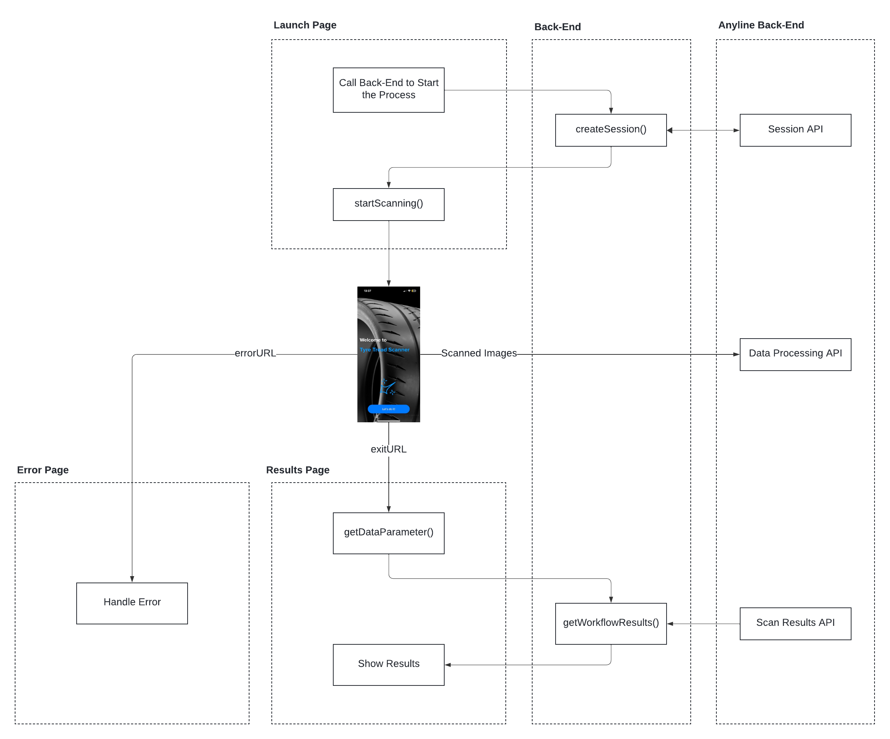

# Tire Tread Instant App SDK - Documentation

## Overview

The Tire Tread Instant App SDK is a JavaScript library that provides the funtionality to use Anyline's Tire Tread scanner as an Instant App/App Clip from a web page. It provides a simple interface for initiating scans, handling results, and managing errors.

## Security Recommendations
We strongly recommend implementing `getToken`/ `createSession` and `getResults`/`getWorkflowResults` in the backend so that the license key is not exposed on the front end. In this repository you can find an example of those end-points implemented in JavaScript for a serverless infrastructure. However, the choice of backend technology is not relevant; you can rebuild the rather simple endpoints in any language/framework of your choice, or integrate them into your existing backend. We also recommend securing the communication between the frontend and backend (depending on your use-case using CORS, CSRF protection, authentication, rate limiting ...).

## Device Requirements
For device requirements for Anyline's Tire Tread product please check out the Tire Tread documentation on the Anyline website. The requirements for the Tire Tread Instant Apps might be stricter.

- Android: Min API Level 28
- iOS: iOS 17


## Overview for multiple scans

1. **Integrate the SDK**: You add the SDK to your web application and implement the backend calls.
2. **Initialize with License**: Init the SDK with your license key on the backend.
3. **Get session token on the backend**: Call `createSession` to get a scanning session on the backend. 
4. **Pass session to the frontend**: Pass this session to the front end.
5. **Start Scanning**: Call the `startScanning` function from the SDK with the data received from `getToken`. This function also needs an `exitURL` and `errorURL` which is a webpage where the user will be redirected to from the app. **Make sure to set the `workflowVersion` to `3` to start the workflow for scanning multiple tires.**
6. **Scanning in Action**: The SDK opens the Tire Tread Instant App on the user's device (both Android and iOS are supported), which provides the tire tread scanning functionality.
7. **Redirect to exitURL**: After the scan, the Instant App automatically redirects the user to the `exitURL` you specified earlier.
8. **Retrieve Results**: On the `exitURL` page use the `getDataParameter` and pass the output to the backend. The backend calls `getWorkflowResults` to fetch the results from the scan.
9. **Show Results**: Pass the results back to the frontend to be displayed.




## Overview for single scan

1. **Integrate the SDK**: You add the SDK to your web application and implement the backend calls.
2. **Initialize with License**: Init the SDK with your license key on the backend.
3. **Get scanning token on the backend**: Call `getToken` to get a scanning token on the backend. 
4. **Pass token to the frontend**: Pass this token to the frontend.
5. **Start Scanning**: Call the `startScanning` function from the SDK with the data received from `getToken`. This function also needs an `exitURL` and and `errorURL` which is a webpage where the user will be redirected to from the app.
6. **Scanning in Action**: The SDK opens the Tire Tread Instant App on the user's device (both Android and iOS are supported), which provides the tire tread scanning functionality.
7. **Redirect to exitURL**: After the scan, the Instant App automatically redirects the user to the `exitURL` you specified earlier.
8. **Retrieve Results**: On the `exitURL` page use the `getDataParameter` and pass the output to the backend. The backend calls `getResults` to fetch the results from the scan.
9. **Show Results**: Pass the results back to the frontend to be displayed.


## Installation

To use the Tire Tread Instant App SDK, include it in your HTML file:

```html
<script src="path/to/ttr_sdk.js"></script>
```
or  add it to your backend code:

```
const TireTreadSDK = require('public/ttr_sdk.js');
```

## Usage

### Initializing the SDK

Create an instance of the SDK:

```javascript
// Replace XXX with your actual license key
let tireSDK = new TireTreadSDK("XXX");

```

### Getting a scan token (single scan)


```javascript
// Should be done in the backend
    const tokenJson = await tireSDK.getToken().catch((error) => {
        return response.status(500).json({ error: error.message });
    });

```

### Getting a scan token (multiple scans)


```javascript
// Should be done in the backend
    const tokenJson = await tireSDK.createSession().catch((error) => {
        return response.status(500).json({ error: error.message });
    });

```

### Starting a Scan

Pass the token to the front end and start the scanning process with `startScanning()`, make sure to adapt the URLs:

```javascript
  tireSDK.startScanning({
   	"exitURL": "http://tirescanworkflow.anyline.io/result/result.html", 
   	"errorURL": "http://tirescanworkflow.anyline.io/error/index.html", 
  	 tokenData: tokenDict,
  	 workflowVersion: // 2 or 3 depending on single/multi scan
   })
  .then(() => {
		console.log("Scanning started");
   })
  .catch(error => {
		console.log("Scanning start error: ", error);
		displayError(error.message);
	});
```

This call will open the Instant App.

#### Options

- **`exitURL (mandatory)`**: URL to redirect to after the scan is completed. This page will be opened in a new browser window after the scan is completed. It will have a `data` string in its query parameters that contains information consumed by `getResults`.
- **`errorURL (mandatory)`**: URL to redirect to if the user aborts the process in the Instant App or something goes wrong. This page will be opened in a new browser window after the scan is completed.
- **`tokenData (mandatory)`**: A token object received with `getToken()`/`createSession()`
- `supportURL`: In some places in the Tire Tread Instant Apps, the user will find a link to a "User Guide". If this field is set, the user will get to defined page, otherwise it will open Anyline's Instant App User Guide.
- `debug`: Enable debug mode for additional console logs. Use the `debug` option for development purposes only.
- `forceAndroid`: Force the SDK to behave as if it is running on an Android device.
- `forceiOS`: Force the SDK to behave as if it is running on an iOS device.
- `workflowVersion`: Puts the SDK into single scan (`2`) mode or multi scan mode (`3`). The default is the single scan mode.
- `showScanResultsInApp`: If set to `false` the scan results are not shown inside the instant app. Instead only "Sucess" or "Failure" are shown. Default is `true`.

#### Options example

```javascript
let options = { 'exitURL' : 'www.example.com', 'debug' : true };
tireSDK.startScanning(options).then(() => {
    // Handle successful scan initiation
}).catch(error => {
    // Handle errors
});
```

### Fetching Scan Results

#### Getting the data parameter

On the `exitURL` website you have to call `getDataParameter()`.
This call extracts the data parameter from the query parameters.

```
const data = await tireSDK.getDataParameter().catch(error => {
	console.log("Error getting data parameter: ", error);
	console.log({ error });
	displayError(error);
};)
```
#### Getting the scan results (single scan)

To retrieve scan results call `getResults()`:

```javascript
// should be called on the backend
const resultData = await tireSDK.getResults({ data: data }).catch((error) => {
	return response.status(500).json({ error: error.message });
});
```


#### Getting the scan results (multiple scans)

To retrieve scan results call `getResults()`:

```javascript
// should be called on the backend
const resultData = await tireSDK.getWorkflowResults({ data: data }).catch((error) => {
	return response.status(500).json({ error: error.message });
});
```


#### Options 
- **`data (mandatory)`**: This must be the output of the `getDataParameter()` call
- `pollingRetries`: How often do we try to poll the backend until it will timeout (in ms). (Default: 100)
- `pollingInterval`: How long do it will wait until retry (in ms). This value is forced to be between 500 and 10000. (Default: 2000 ms)

#### Example
##### Single scan:

```javascript
// should be called on the backend
tireSDK.getResults({ 
	data: data, 
	"pollingRetries" : 20 
}).then(result => {
    // Process result
}).catch(error => {
    // Handle errors
});
```
##### Multiple scans:
```javascript
// should be called on the backend
tireSDK.getWorkflowResults({ 
	data: data, 
	"pollingRetries" : 20 
}).then(result => {
    // Process result
}).catch(error => {
    // Handle errors
});
```

## Error Handling

The SDK throws `APIError` instances in case of errors. These errors contain additional details like statusCode and httpErrorCode.


### APIError Class

The `APIError` class in the Tire Tread Instant App SDK is an extension of the standard JavaScript `Error` class. It is used to represent errors that occur within the SDK's operations.

#### Constructor

```javascript
new APIError(message, statusCode, httpErrorCode = 0)
```

#### Properties

- `name`: Always `APIError`
- `statusCode` (Number): The custom status code for the error.
- `message` (String): The error message.
- `httpErrorCode` (Number): The HTTP error code (if applicable).


The SDK defines several error types, each represented by a unique status code:


- `NO_DATA_PARAMETER: 1001` - Indicates missing data parameter in URL.
	-  This is an implementation error. The `exitURL` ist called with a `&data=ASDF` parameter by the iOS or Android app. Make sure that the `exitURL` is set correctly and the data paramter is not lost. Redirect to restart the process.
- `PARSING_ERROR: 1002` - Error occurred during parsing of incoming data.
	-  This is an implementation error. The `exitURL` ist called with a `&data=ASDF` parameter by the iOS or Android app. Make sure that the `exitURL` is set correctly and the data paramter is not lost. Redirect to restart the process.
- `NO_RESULTS: 1003` - No results returned from the API.
	- The scan was not correctly completed or initialised. Redirect to restart the process.
- `TIMEOUT: 1004` - The request to the server timed out.
	- The backend had a timeout. Try to start the scan again. Or modify the timeout parameters.
- `DEVICE_NOT_SUPPORTED: 1005` - The device is not supported.
	- This device is not an iOS or Android device. You can force the SDK to act as if its using another device with `forceiOS` and `forceAndroid`
- `CONNECTION_ERROR: 1006` - Error in establishing a connection to the server.
	- This errror means that the request to the backend failed. The error object holds the status code of the request in `httpErrorCode `. Try to restart the request if this happens.

- `PARAMETERS_MISSING: 1007` - Required parameters are missing in the function call.
	- This error is thrown if the mandatory `exitURL` parameters is not set.
- `SERVER_RESPONSE_ERROR: 1008` - The server's response is not as expected.
	-  This error is thrown if the servers response is unusual and unusable. It means for example that there was no measurement was received with the result. Restart the scanning process if this happens.

-  `TOKEN_ERROR: 1009` - `startScanning()` received a malformed token 
	-  Request a new token with `getToken()`
- `PERMISSION_ERROR: 1009` - The server returned a permission error. It is very likely that the license has expired or is wrong.
	-  Check if your license has expired

#### Example Usage

``` javascript
tireSDK.getResults({
	data: data
}).then(result => {
    // Process result
}).catch(error => {
	if(error.statusCode == tireSDK.SDKErrorTypes.TIMEOUT) {
		console.log("The backend was not reachable");
	}
});

```


## Example Code

### Single scan workflow

#### Getting a token

```javascript
// should be called on the backend
const tireSDK = new TireTreadSDK(licenseKey);    
const tokenJson = await tireSDK.getToken().catch((error) => {
	return response.status(500).json({ error: error.message });
});
```

#### Starting a scan

```javascript

const tokenDict = await fetch("./api/getToken", { mode: 'no-cors' })
	.then(response => response.json()).catch(error => {
		console.log("Error fetching token dict: ", error);
		displayError(error.message);
	});

tireSDK.startScanning({ 
	debug: true, 
	"exitURL": "http://tirescanworkflow-staging.anyline.io/result/result.html", 
	"errorURL": "http://tirescanworkflow-staging.anyline.io/error/index.html",
	tokenData: tokenDict 
	})
	.then(() => {
		console.log("Scanning started");
	})
	.catch(error => {
		console.log("Scanning start error: ", error);
		displayError(error.message);
	});
```

#### Getting the data parameter

```javascript
const data = await tireSDK.getDataParameter().catch(error => {
	console.log("Error getting data parameter: ", error);
	displayError(error);
	})
```

#### Getting the result
```javascript
// should be done on the backend
const tireSDK = new TireTreadSDK(licenseKey);
const resultData = await tireSDK.getResults({ 
	data: data 
})
.catch((error) => {
	return response.status(500).json({ error:error.message });
});
```


#### Handling Errors
```javascript
function displayError(error) {
    if (error instanceof TireTreadSDK.APIError) {
        console.error(`API Error - Message: ${error.message}, Code: ${error.statusCode}`);
    } else {
        console.error(`Unexpected Error - ${error.message}`);
    }
}
```
### Multi scan workflow

#### Getting a token

```javascript
// should be called on the backend
const tireSDK = new TireTreadSDK(licenseKey);    
const tokenJson = await tireSDK.createSession().catch((error) => {
	return response.status(500).json({ error: error.message });
});
```

```javascript

const tokenDict = await fetch("./api/getToken", { mode: 'no-cors' })
	.then(response => response.json()).catch(error => {
		console.log("Error fetching token dict: ", error);
		displayError(error.message);
	});

tireSDK.startScanning({ 
	debug: true, 
	"exitURL": "http://tirescanworkflow-staging.anyline.io/result/result.html", 
	"errorURL": "http://tirescanworkflow-staging.anyline.io/error/index.html",
	tokenData: tokenDict,
	workflowVersion: 3
	})
	.then(() => {
		console.log("Scanning started");
	})
	.catch(error => {
		console.log("Scanning start error: ", error);
		displayError(error.message);
	});
```

#### Getting the data parameter

```javascript
const data = await tireSDK.getDataParameter().catch(error => {
	console.log("Error getting data parameter: ", error);
	displayError(error);
	})
```

#### Getting the result
```javascript
// should be done on the backend
const tireSDK = new TireTreadSDK(licenseKey);
const resultData = await tireSDK.getWorkflowResults({ 
	data: data 
})
.catch((error) => {
	return response.status(500).json({ error:error.message });
});
```


#### Handling Errors
```javascript
function displayError(error) {
    if (error instanceof TireTreadSDK.APIError) {
        console.error(`API Error - Message: ${error.message}, Code: ${error.statusCode}`);
    } else {
        console.error(`Unexpected Error - ${error.message}`);
    }
}
```
